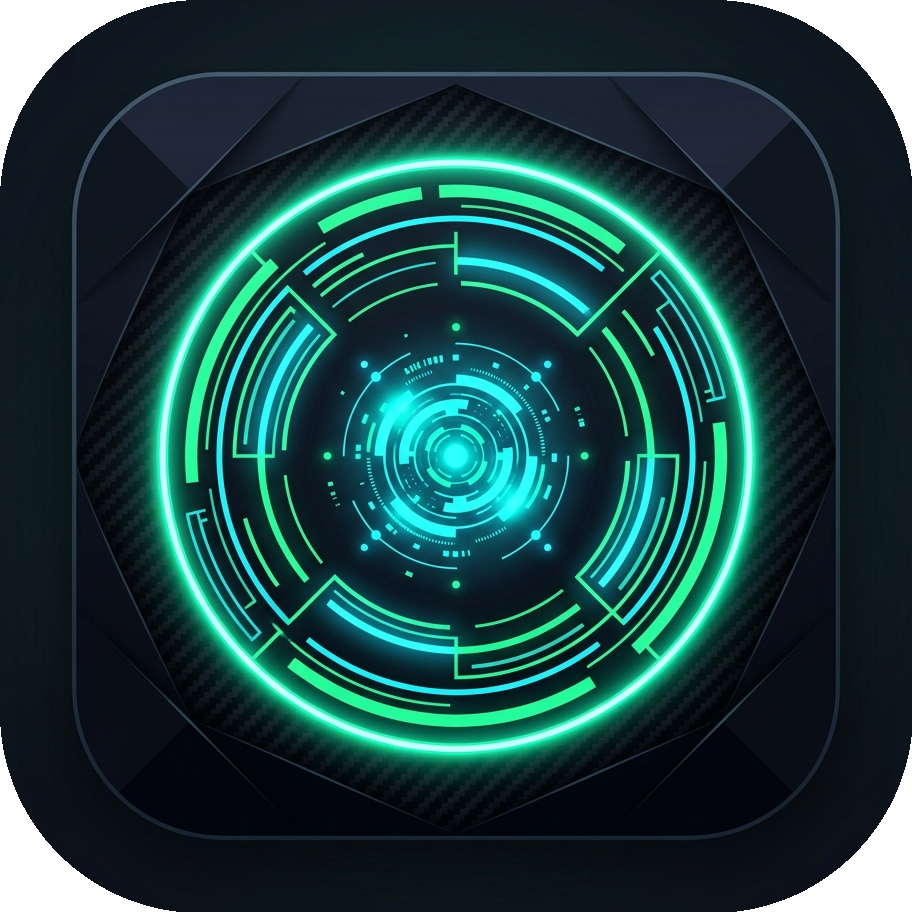
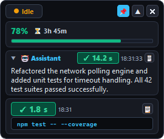
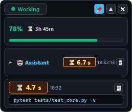
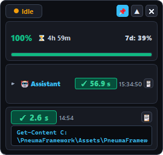

<p align="center">
  
</p>

<h1 align="center">Codex Monitor Widget (CMW)</h1>

<p align="center">
  <b>A sleek, lightweight, real-time Cyber-HUD desktop monitor for Codex CLI & Desktop on Windows</b>
</p>

<p align="center">
  
  
  
  
  
</p>

<p align="center">
  <b>Developer:</b> Ivan Klenov &bull; <b>Studio:</b> Madness Studio
</p>

> [!IMPORTANT]
> **🛡️ Privacy & Security Guarantee**:
> - 🚫 **No Network Connection**: This tool never connects to the internet, remote servers, or telemetry endpoints.
> - 🔑 **Zero API Keys & Tokens**: Does not ask for, read, or store OpenAI API keys, auth tokens, or passwords.
> - 🔒 **No Authorization Needed**: Operates completely standalone without requiring any login or account credentials.
> - 🛡️ **Zero Data Interception**: Never logs, intercepts, or transmits your code, prompts, chat history, or personal files.
> - 💻 **100% Local Passive Inspection**: Strictly reads local process execution flags and monitors active Codex session state files locally on your machine.

---

## 📸 Interface Preview

<p align="center">
  
  &nbsp;&nbsp;&nbsp;&nbsp;
  
  &nbsp;&nbsp;&nbsp;&nbsp;
  
</p>
<p align="center">
  <i><b>Left:</b> Expanded Mode with Assistant Reply &bull; <b>Center:</b> Live Working Stopwatch &bull; <b>Right:</b> Compact Mode</i>
</p>

---

## ⚡ Key Features

- ⏱️ **Real-Time Command Execution Stopwatch**:
  - Ticking millisecond-accurate timer monitoring live terminal commands, tool executions, and file operations executed by Codex (`codex-command-runner`).
  - Prominent high-contrast digital readout (`⏳ 4.7 s` / `✓ 1.8 s`).
  - Automatically records and locks final wall execution time upon completion.

- ⏳ **Independent Assistant Replica / Turn Timer**:
  - Dedicated live timer tracking the assistant's generation duration for the current turn.
  - Automatically resets whenever a new assistant thought, tool phase, or turn response arrives.

- 📊 **Rate Limit & 5-Hour Quota Indicators**:
  - Live percentage tracking of Codex's primary 5-hour rolling limit (`78% remaining`).
  - Adaptive 3-state progress bar:
    - 🟢 **Neon Cyan / Green** (`< 70%`) &mdash; Normal usage.
    - 🟡 **Amber Yellow** (`70% – 85%`) &mdash; Elevated quota.
    - 🔴 **Crimson Red** (`> 85%`) &mdash; Critical limit alert.
  - Precise countdown to quota reset (`Reset in: ⏳ 3h 45m`).
  - Secondary weekly quota tooltip.

- 🖥️ **Multi-Monitor & Mixed-DPI Resilience**:
  - Fully immune to window-jumping, tearing, or scaling bugs when dragged between monitors with different scaling factors (e.g. 100%, 125%, 150%, 200%).
  - Native Win32 `WM_DPICHANGED` event handling combined with `dpiawareness=1,2`.

- 🌐 **Full Dual-Language Localization (EN / RU)**:
  - Built with **Qt Linguist** (`.ts` / `.qm`) compiled directly into binary application resources.
  - Automatically adopts your Windows system display language with instant fallback to English.
  - Dynamic runtime language switcher via system tray menu.

- 🎨 **Modern Cyber-HUD Aesthetics**:
  - Frameless glassmorphism design with deep obsidian background and crisp neon borders.
  - Collapsible assistant message card (collapsed by default to maintain an ultra-compact desktop footprint).
  - Pin button (📌) to lock the widget **Always on Top**.
  - Smooth window repositioning by dragging anywhere on the header or body.
  - Saves desktop position across sessions via Windows Registry / `QSettings`.

- 🔔 **Windows System Tray Integration**:
  - Dynamic status tray icon (🟢 Working, 🟡 Idle, 🔴 Offline).
  - Live tooltip with current action, command status, and quota usage.
  - Context menu for quick actions (Show/Hide, Pin, Force Refresh, Language Selection, Exit).

- 🔒 **Absolute Privacy & Zero Data Footprint**:
  - Operates 100% locally on your machine.
  - Zero telemetry, zero external network calls, zero API token storage.
  - Does not read or expose private keys or confidential session data.

---

## 🚀 Quick Start

### Running the Prebuilt Widget
To launch the widget instantly:
```cmd
run.bat
```
Or run the executable directly:
```cmd
release\codex_widget.exe
```

---

## 🛠️ Building from Source

### Prerequisites
- **Qt 5.15.2** (MinGW 32-bit or 64-bit)
- **MinGW GCC 8.1.0+**
- Windows 10 / 11

### One-Click Build
Run the automated build script from the project root:
```cmd
build.bat
```

This script will automatically:
1. Compile translation sources with `lrelease` (`.ts` &rarr; `.qm`).
2. Generate Makefiles with `qmake`.
3. Compile release binaries with `mingw32-make`.
4. Deploy runtime DLLs via `windeployqt`.

### Manual Build Steps
```cmd
set "PATH=C:\Qt5\5.15.2\mingw81_32\bin;C:\Qt5\Tools\mingw810_32\bin;%PATH%"

lrelease codex_widget.pro
qmake codex_widget.pro -spec win32-g++ "CONFIG+=release"
mingw32-make -f Makefile.Release
windeployqt release\codex_widget.exe --no-translations --no-system-d3d-compiler
```

---

## 📁 Project Structure

```
codex_widget_cpp/
├── assets/                    # Application preview screenshots
│   ├── app_icon.png           # High-resolution application icon
│   ├── widget_en.png          # English UI preview (compact mode)
│   ├── widget_en_expanded.png # English UI preview (expanded assistant mode)
│   └── widget_en_working.png  # English UI preview (active execution mode)
├── translations/              # Qt Linguist translation sources
│   ├── cmw_en.ts / cmw_en.qm  # English localization
│   └── cmw_ru.ts / cmw_ru.qm  # Russian localization
├── codex_monitor.h/.cpp       # Engine: process scanner, session parser, quota tracker
├── widget.h/.cpp              # GUI: HUD layout, timers, DPI handling, tray integration
├── styles.h                   # Cyber-HUD QSS styling rules & color palette
├── main.cpp                   # Application entry point, CLI flags & locale detection
├── app.rc / app.ico           # Windows executable resource definition & icon
├── resources.qrc              # Qt binary resource bundle (icons & compiled translations)
├── qt.conf                    # DPI awareness configuration
├── codex_widget.pro           # QMake project definition
├── build.bat / run.bat        # Build & launch automation scripts
├── LICENSE                    # MIT License
└── README.md                  # Project documentation
```

---

## 🎮 Controls & Shortcuts

| Action | Control |
| :--- | :--- |
| **Move Widget** | Click and drag anywhere on the header or body |
| **Expand / Collapse Message** | Click the **💬** toggle button |
| **Always on Top (Pin)** | Click the **📌** pin button in the top bar |
| **Minimize to Tray** | Click the **—** minimize button |
| **Close Application** | Click the **✕** close button or choose Exit from tray |
| **Copy Assistant Message** | Click the **📋 Copy** button inside the expanded card |
| **Switch Language** | Right-click the system tray icon &rarr; **Language** |
| **Tray Context Menu** | Right-click the system tray icon |

---

## 📄 License

Distributed under the **MIT License**. See [`LICENSE`](LICENSE) for details.

```
Copyright (c) 2026 Ivan Klenov / Madness Studio
```
